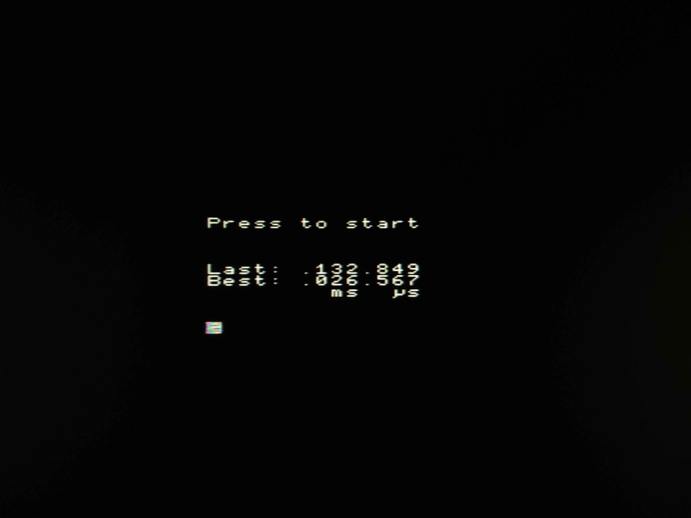

   

# Tiny Tapeout R0

Ultra-precise human reaction meter

- [Read the documentation for project](docs/info.md)

## Why this project is so cool for learning

* **Design complexity**: VGA, FSM, PRNG, Timers, Buttons, BCD counter and Bitmap Font introduce more fun in a design
  process.
* **Area-focused optimizations**: In FPGA, you mainly perform optimizations related to timing requirements, but in ASIC,
  it is more important to keep the area of the design small.
* **Fun and Curiosity**: It is interesting to measure the speed of your own reaction and be sure that the input is not
  delayed by the CPU and the timer does not fail.

## What is Tiny Tapeout?

Tiny Tapeout is an educational project that aims to make it easier and cheaper than ever to get your digital and analog
designs manufactured on a real chip.

To learn more and get started, visit https://tinytapeout.com.
